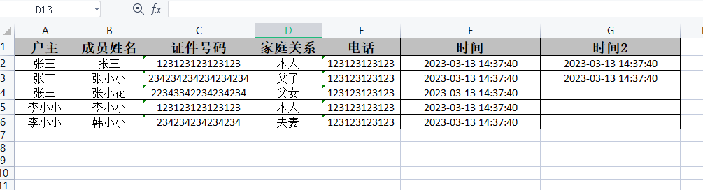

# easyexcel-plus-spring-boot-starter

## 介绍

为了简化easyexcel的使用，进行一些扩展，只需要通过一个注解做到导出excel

## 说明

基于easyexcel的基础上扩展，

- excel样式目前设置了、水平、垂直居中，自动换行，自适应列宽（但有些不是很精确）,如列宽、行高达不到想要的效果可以参考easyexcel的样式注解添加到实体类上
- 提供字典值映射的注解（导出根据enum实现字典的映射导出）
- 提供合并单元格导出功能
- 持续更新中

## 使用说明
## 1、简单导出

### 	1.1 模板对象

​		建议在类上都标注@ExcelIgnoreUnannotated注解，作用为忽略没有标注ExcelProperty的字段，如果所有字段都要导出，可以不标注

```java
@ExcelIgnoreUnannotated // 忽略没有标注@ExcelProperty的字段导出
public class FamilyMemberDTO {

 	@ExcelProperty("户主")
    private String hzmc;

    @ExcelProperty("成员姓名")
    private String cyxm;

    @ExcelProperty("证件号码")
    private String cyzjhm;

    @ExcelProperty("家庭关系")
    private String yhzgx;

    @ExcelProperty("电话")
    private String lxdh;

    @ExcelProperty("时间")
    private LocalDateTime time;

    @ExcelProperty("时间2")
    private Date date;
}
```

### 	1.2 controller

​			方法标注**@ResponseExcel**注解，

​				**name**：文件名 **必填**

​				**sheetName**：sheet名称 **必填**

​				**suffix**：文件后缀   **非必填，默认XLSX**

​			方法正常返回List就可以

​				**注意返回值必须是List，并且list的元素不能时list**


```Java
@GetMapping("/export")
@ResponseExcel(name = "测试",sheetName = "测试sheet")
public List<FamilyMemberDTO> exportTest(){
    List<FamilyMemberDTO> dtoList = getData();
    return dtoList;
}
```

### 	1.3 导出效果




------

## 2、带有字典映射的导出

### 	2.1 创建字典enum并实现ExcelEnum

​			实现ExcelEnum接口提供泛型，泛型为实体类字段的类型，一般为Integer或者String，并实现 getByCode方法 提供根据 字典值返回字典描述

```java
@AllArgsConstructor
@Getter
public enum SexEunm implements ExcelEnum<Integer> {

    /**
     * 男
     */
    MAN(1,"男"),

    /**
     * 女
     */
    WOMAN(2,"女");

    Integer code;

    String desc;

    @Override
    public String getByCode(Integer code) {
        for (SexEunm value : SexEunm.values()) {
            if (value.getCode().equals(code)){
                return value.getDesc();
            }
        }
        return code.toString();
    }

}
```

### 2.2 模板对象

​			在需要字典映射的字段@ExcelProperty注解添加 converter = ExcelEnumValueConverter.class 属性

​			并标注 @ExcelEnumValue(SexEunm.class)注解 value值为enum的class对象

```java
@Data
@ExcelIgnoreUnannotated
public class FamilyMemberDTO{

    @ExcelProperty("户主")
    private String hzmc;

    @ExcelProperty("成员姓名")
    private String cyxm;

    @ExcelProperty(value = "成员性别", converter = ExcelEnumValueConverter.class)
    @ExcelEnumValue(SexEunm.class)
    private Integer cyxb;
 
    ......
}
```

### 	2.3 controller

```Java
@GetMapping("/export")
@ResponseExcel(name = "测试",sheetName = "测试sheet")
public List<FamilyMemberDTO> exportTest(){
    List<FamilyMemberDTO> dtoList = getData();
    return dtoList;
}
```
### 	2.4 导出效果


------

## 3、合并单元格导出

​	合并列导出功能目前是根据对象中 指定列分组，在ResponseExcel注解里指定要合并哪些列

### 3.1 模板对象

​		ExcelProperty注解value值为一个数组，可以提供多个列名，默认自动合并head相近同名列

​		在分组字段上标注ExcelMergeColumn注解，会根据这个字段分组

```java
@Data
@ExcelIgnoreUnannotated
public class FamilyMemberMergeDTO {

    @ExcelProperty(value = {"自定义合并", "户主", "户主"})
    @ExcelMergeColumn
    private String hzmc;

    @ExcelProperty(value = {"自定义合并", "家庭成员情况", "成员姓名"})
    private String cyxm;

    @ExcelProperty(value = {"自定义合并", "家庭成员情况", "成员性别"}, converter = ExcelEnumValueConverter.class)
    @ExcelEnumValue(SexEunm.class)
    private Integer cyxb;

    @ExcelProperty(value = {"自定义合并", "家庭成员情况", "证件号码"})
    private String cyzjhm;

    @ExcelProperty(value = {"自定义合并", "家庭成员情况", "家庭关系"})
    private String yhzgx;

    @ExcelProperty(value = {"自定义合并", "家庭成员情况", "电话"})
    private String lxdh;

    @ExcelProperty(value = {"自定义合并", "家庭成员情况", "时间"})
    private LocalDateTime time;


}
```

### 3.2 controller

ResponseExcel注解

​	isMerge属性设为true

​	mergeColumn属性指定要合并的列

​	headNumber sheet头的行数 **可以不传，不传则取ExcelProperty注解value长度**

```java
@GetMapping("/export/merge")
@ResponseExcel(name = "测试", sheetName = "测试sheet",isMerge = true,mergeColumn = {0},headNumber = 3)
public List<FamilyMemberMergeDTO> exportMergeTest() {
    List<FamilyMemberMergeDTO> dtoList = getMergeData();
    return dtoList;
}
```

### 3.3 导出效果


## **其它注意事项**

- 如果导出报错，请查看poi依赖版本是否冲突，并解决
